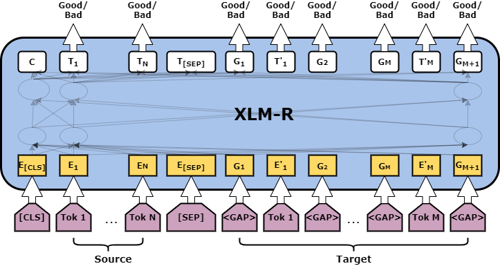

# Word Level TransQuest Architecture
WE have one architecture that is capable of providing word level quality estimation models; MicroTransQuest. 

### Data Preparation
Please have your data as a pandas dataframe in this format. 

| source_column                           | target_column                     | source_tags_column | target_tags_column                  |
| ----------------------------------------| ----------------------------------|--------------------|-------------------------------------|
| 	52 mg wasserfreie Lactose .           | 52 mg anhydrous lactose .         | [OK OK OK OK OK]   | [OK OK OK OK OK OK OK OK OK OK OK]  |
|  România sanofi-aventis România S.R.L.  | Sanofi-Aventis România S. R. L.   | [BAD OK OK OK]     | [BAD BAD OK OK OK OK OK OK OK OK OK]|

Please note that target_tags_column has word level quality labels for gaps in the target too. Therefore, it has 2*N+1 labels, where N is the total number of tokens in the target. For more information please have a look at WMT word level quality estimtion task.

Now, you can consider MicroTransQuest to build the QE model.

## MicroTransQuest
The input of this model is a concatenation of the original sentence and its translation, separated by the *[SEP]* token. As shown in the Figure target sentence contains gaps too. Then the output of the each token is passed through a softmax layer to reflect the quality scores.




### Minimal Start for a MonoTransQuest Model

Initiate and train the model like in the following code. train_df and eval_df are the pandas dataframes prepared with the instructions in Data Preparation section.

```python
from transquest.algo.word_level.microtransquest.run_model import MicroTransQuestModel
from transquest.algo.word_level.microtransquest.format import prepare_data
import torch

model = MicroTransQuestModel("xlmroberta", "xlm-roberta-large", labels=["OK", "BAD"], use_cuda=torch.cuda.is_available(), args=microtransquest_config)
model.train_model(prepare_data(train_df, microtransquest_config)  , eval_df=(prepare_data(eval_df, microtransquest_config)))
```

An example microtransquest_config is available [here.](https://github.com/TharinduDR/TransQuest/blob/master/examples/word_level/wmt_2018/en_de/microtransquest_config.py). The best model will be saved to the path specified in the "best_model_dir" in microtransquest_config. Then you can load it and do the predictions like this. 

```python
from transquest.algo.word_level.microtransquest.run_model import MicroTransQuestModel

model = MonoTransQuestModel("xlmroberta", monotransquest_config["best_model_dir"], 
                               use_cuda=torch.cuda.is_available(), args=microtransquest_config)

predictions, raw_outputs = model.predict([[source, target]])
print(predictions)

```
